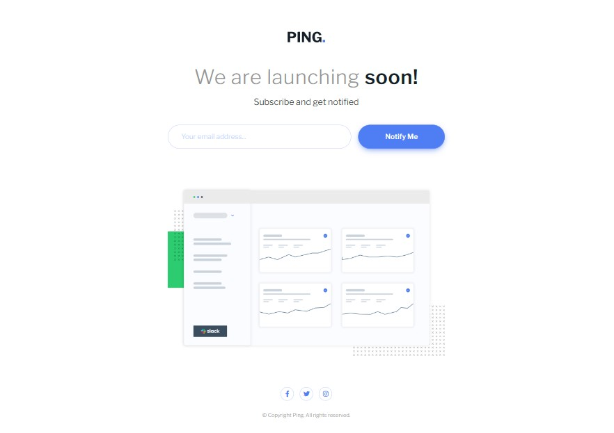

# Frontend Mentor - Ping coming soon page solution

This is a solution to the [Ping coming soon page challenge on Frontend Mentor](https://www.frontendmentor.io/challenges/ping-single-column-coming-soon-page-5cadd051fec04111f7b848da). Frontend Mentor challenges help you improve your coding skills by building realistic projects. 

### The challenge
- exploiting 
- Matching the submit button 
- The hover state gradient not working 
- I do not have access to the Figma sketch so the design is not pixel perfect.
### Screenshot

### Links

- Live Site URL: [Netlify](https://5leepy-ping-coming-soon-page.netlify.app/)
- Repository URL: [GitHub](https://5leepy-ping-coming-soon-page.netlify.app/)

### Built with

- Semantic HTML5 markup
- SCSS
- CSS
- Flex-box
- Bootstrap
- Mobile-first workflow

### Useful resources

- [Custom CSS RESET](https://www.joshwcomeau.com/css/custom-css-reset/) - This helped me to reset my css. I really liked this pattern and will use it going forward.
- [CSS Grid Guide](https://css-tricks.com/snippets/css/complete-guide-grid/) - This is an amazing article which helped me finally understand CSS Grid. I'd recommend it to anyone still learning this concept.
- [Sass, BEM, & Responsive Design](https://www.youtube.com/watch?v=jfMHA8SqUL4&t=6s&ab_channel=CoderCoder) - This Helped me to understand css and scss 

## Author

- Nadir Nahdi
- Frontend Mentor - [@5leepy](https://www.frontendmentor.io/profile/5leepy)
- Twitter - [@NadirNahdi](https://twitter.com/NadirNahdi)

## Acknowledgments

- [TheCoderCoder](https://www.youtube.com/@TheCoderCoder) 
- [Kevin Powell](https://www.youtube.com/@KevinPowell)

